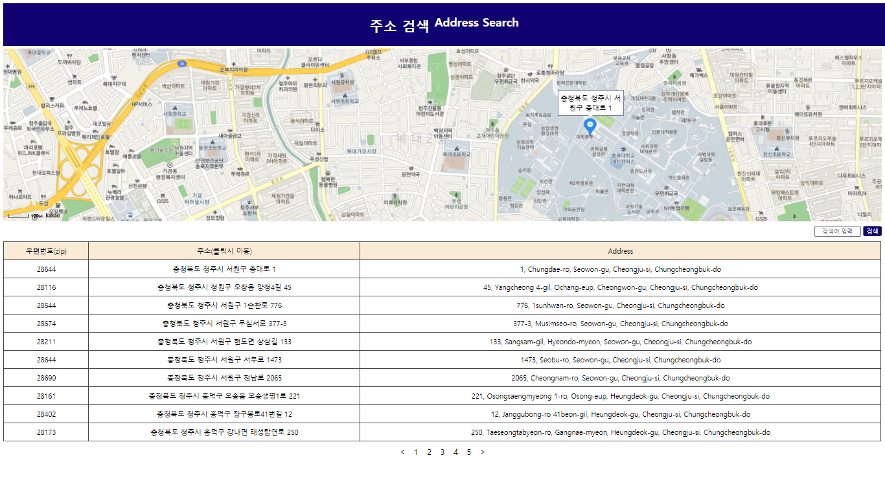

# WP API 실습

**Github Page 주소** [LINK](https://s-hun.github.io/wp-api) 
**juso API** [LINK](https://www.juso.go.kr/) 
**Kakao API** [LINK](https://developers.kakao.com/)

 
 
 

## 주소 API 분석

`search(keyword, srPage)
        .then(res => res.text())
        .then(txt => JSON.parse(txt.replace(/^\(/, '').replace(/\)$/, '')).results)
        .then(display)
        .then(() => form.reset())
        .catch(console.error);`

저는 이 코드가 메인 동작의 역할을 한다고 보았습니다.
form에 입력된 문자열을 keyword에 저장하여 해당 텍스트에서 Json을 추출하고 각 결과들을 iteration할 수 있는 형태로 저장하여 display에서 li의 요소로 **document**를 활용하여 ul 태그의 child로 append 되고 있었습니다. (위 코드는 제가 인자를 수정하였습니다.)
 
 
 
## 수정사항

먼저 추가로 사용한 API는 카카오맵을 이용하여 주소를 확인하고 싶을 때, 해당 위치를 표기하도록 구성하였습니다. 또 페이지네이션, 영문 주소 표기를 추가하였으며, ul 태그로 리스트로 표현되어있던 주소 리스트를 table로 바꾸었습니다. 요약하면 아래와 같습니다.

1. 카카오맵 API 이용
2. 페이지네이션 추가
3. ul 태그 -> table 태그로 변환

이 밖에 css를 통해 꾸며보았습니다. 꾸미는 것은 미적 감각이나 여러 경험이 많이 필요한 것 같습니다. 필요한 기능을 표현하는 것 외에도 어떻게 보일지 등 고려할 사항이 많아서 많은 view를 추가하지 못하였습니다.

### **1. 카카오맵 API**

기본적으로 카카오맵은 document가 굉장히 잘 형성되어 있었습니다. 기능면에서 **네이버지도 API**랑 비교하였을 때 크게 뒤지지 않으면서도 오히려 지속적인 지원을 아직은 기대할 수 있기 때문에 더 범용성이 크다고 기대하였습니다. 
먼저 키를 생성하고 script의 소스로 키를 이용하여 API를 로드하였습니다. 그리고 지도를 표시하고 추가적으로 지도에 **마커**라고 불리는 위치 정보를 표시하기 위해서 여러 함수들을 정의하였습니다. 그리고 위치 정보를 마커로 표현함과 함께 지도의 중앙을 해당 장소로 이동시켜 사용자에게 보여주었습니다.
 
 

### **2. 페이지네이션**

한번쯤 만들어보고 싶은 기능이었습니다. 이렇게 만드는 것이 맞는지 모르겠지만, juso API의 페이지 기능을 이용하여 제작하였습니다. juso API의 검색 결과에 해당하는 주소의 개수 totalCount를 변수에 저장하고 그만큼만 표현될 수 있도록 페이지 수를 제한하였으며, 첫 페이지와 마지막 페이지를 표현하여 alert를 이용하여 넘어갈 수 없음을 나타내었습니다. 각 페이지에는 currentPerPage를 10으로 표현. 10개의 결과를 내보낼 수 있도록 설계하였으며, rank라는 변수를 만들어 현재 나타내고 있는 페이지를 관리할 수 있도록 하였습니다.
 
 

### **3. ul 태그 -> table 태그로 변환**
이건 간단하게 변환하였습니다. 특별한 점이라면 thead와 tbody를 당연히 나누어 css를 적용하였다는 점입니다. thead에는 각 열이 무엇을 나타내었는지, tbody에는 정보가 담긴 각 행이 채워지도록 하였습니다. 간단히 설명하자면 ul을 tbody의 tr로 바꾸고 li 대신 td를 그 아래에 생성하였습니다.
 
 
 

## 비고 및 고찰

웹은 다양한 자료를 참고하는 것이 바탕이 되어야한다고 느꼈습니다. 당장 부딪히고 연습해보며 늘리는 것보다 다양한 구현 사례가 인터넷에 널려있는 만큼 많은 자료를 참고하고 뜯어보며 더 큰 실력향상을 이룰 수 있을 것이라는 생각이 들었습니다. 
  
여러 API를 많이 찾았습니다. 카카오, 네이버만 해도 음성, 카메라, 검색 등 많은 API를 제공하고 있었고, 이 밖에도 많은 회사가 Open API를 많이 제공하고 있었습니다. 이런 기능들을 이용함으로써 그만큼 유용한 정보도 많이 수집할 수 있기 때문에 제공하는 것이겠지만, 잘 생각해보고 활용하면 제대로 된 응용 프로그램을 만들 수 있지 않을까하는 생각이 듭니다.
  
최근에는 안드로이드 앱같은 경우에 웹 어플리케이션이라는 것을 구성한다는 것도 알았는데, 이렇게 API를 웹에서 활용할줄만 알아도 웹 어플리케이션을 그대로 폰으로 구동하면 쉽게 활용할 수 있을 것 같습니다. 앞으로는 SQL DB, HTTP 등을 잘 활용해보면 좋을 것 같습니다.