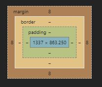
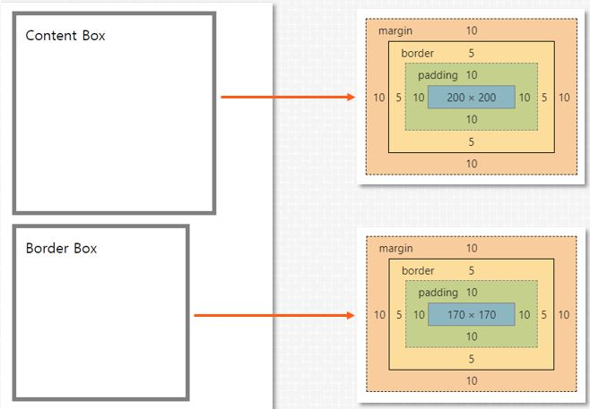

### Subject Web Application Programming
- 2016038028 배석훈

> ### **box**

HTML 문서를 표현하기 위한 소 단위.

다양한 특성을 지정할 수 있다.

> ### **width, height**

박스의 폭(width)와 높이(height)를 지정하는 속성

inline 형태의 요소는 폭과 높이를 지정할 수 없다.

> ### **padding**

요소의 내용물과 박스 사이의 여백

> ### **margin**

다른 요소와 요소 사이의 간격

padding과 margin은 상우하좌 4방향으로 설정할 수 있으며,

방법에 따라 상하, 좌우를 따로 아니면 4방향 모두 따로 설정할 수 있다.

단위는 기본적으로 px, em, % 등 다양하다.

> ### **border**

요소의 외곽선

<두께>, <스타일(선의 형태)>, <색상>을 지정할 수 있으며, 

border-<방향>으로 특정 방향에만 지정할 수도 있다. 

border-\<radius> 속성으로 왼쪽 위 모서리부터 순서대로 둥글게 만들 수 있다. 

> ### **box-sizing**

width와 height 속성이 적용되는 방식을 변경하는 속성으로

content-box와 border-box로 지정할 수 있다.

**content-box**: 요소 내의 content 크기를 기준으로 박스의 크기를 결정

**border-box**: 요소의 border를 기준으로 박스의 크기를 결정

> ### **display**

요소가 화면에 어떻게 보여지게 하는가를 결정하는 속성

대표적으로 많이 사용되는 none, block, inline, flex, grid 등의 특성이 있다.

**none**: 선택된 요소를 화면에서 보이지 않게 함

**block**: 선택된 요소를 block(위에서 아래로 쌓이는) 형식으로 지정

**inline**: 선택된 요소를 inline(옆으로 나열되는) 형식으로 지정

> ### **위치 관련 속성**

1. **position**  
* absolute - 부모 요소를 기준으로 절대 위치 좌표를 설정
* static(default) - 요소가 순서대로 배치, direction 속성을 추가로 사용하여 좌에서 우, 우에서 좌로 배치되는 순서 변경 가능
* fixed - 화면을 기준으로 절대 위치 좌표 설정
* relative - 초기 위치 상태를 기준으로 위치 좌표 설정

2. **상하좌우**  
positiontop, bottom, left, right 값에 따라 적용 기준이 달라진다.

3. **z-index**  
두 요소가 겹칠 경우 화면의 위로 쌓이는 위치를 지정 
즉, 2차원 평면으로 보이는 HTML 공간에 Z축 요소를 지정하는 요소

> ### **overflow**

요소 내부의 내용물(자식 요소 포함)의 크기가 박스 크기를 넘을 경우 어떻게 처리할 지 지정

가로 세로를 다르게 지정할 수 있다. hidden, scroll 설정이 가능하다.

float에서 추가적인 기능을 갖기도 하는데, 이후에 설명한다.

## Display 없는 페이지
> ### **nav**

nav 태그로 상단바 메뉴를 만드려고 했는데, 상단바 메뉴 밑으로 내용이 들어감을 확인하였습니다. 따라서 class가 navigation인 div를 상단바로 지정하였습니다.

> ### **div with image**

박스 안에 글자가 들어가야 합니다. img 태그는 블럭 요소로 일반적으로 그 위에 글자를 넣을 수 없습니다. 저는 여기서 div에 background-image 스타일을 이용하여 글자도 넣으면서 배경을 사진을 넣어 활용하였습니다. 

만약, img 태그를 이용하고 싶다면, z-index를 활용하거나 새로운 컨테이너로 감싸고 위치 지정을 이용하여 글자와 사진 모두 있는 화면을 구성할 수 있을 것 같습니다.

> ### **float**

다른 요소의 정상적인 흐름에서 벗어나 왼쪽 또는 오른쪽으로 부유하게 되며, left, right의 속성에 따라 왼쪽에 또는 오른쪽에 부유하도록 할 수 있다.

이 속성이 적용된 요소의 부모에 overflow: hidden을 해주면 사이즈만큼 auto로 지정되면서 min_size를 꽉 채워준다. 

## Display: flex

> ### **설명**

Flex 박스 인터페이스 내의 아이템 간 공간 배분과 강력한 정렬 기능을 제공하기 위한 1차원 레이아웃 모델

flex-direction 속성을 이용해 어떤 부모 컨테이너 내부의 자식 요소들이 어떤 순서로 쌓일지 정row, column할 수 있으며 내부 요소가 쌓이는 방향을 정했다면 위치justify, align content도 정하고 wrap 속성을 통해 자료가 계속 쌓이며 비율이 조정nowrap될지 아니면 비율을 유지wrap한채로 행, 열을 넘을지 정한다.

align, justify item을 통해서 내부 아이템들의 특성을 바꿔줄 수 있으며, align, justify self를 통해서 자식 요소 스스로 정의할 수 있고, flex display 컨테이너의 자식 요소에 order를 정해줘서 컨테이너 내부에 자식 요소들이 등장하는 순서를 변경할 수 있다. 

이 밖에도, flex-grow, flex-shrink를 이용하여 컨테이너를 요소가 채우지 못하거나 초과할 때, 그 비율을 조정할 수 있으며, flex-basis를 이용하여 요소 안의 내용에 따라 비율이 변경되도록 만들 수 있습니다.

> ### **문제 해결**

최초 컨테이너 크기를 width: 960px인 flex display 정의하고, 좌우가 960px인 nav, 좌우가 960px인 사진과 내용, width: 500px에 margin-right가 60px인 단락과, 400px인 단락 아래로는 100px의 사진과 그 옆으로 860px의 단락, 제일 아래에 배치되도록 width: 960px의 footer를 추가하였다. 

> ### **정리**
>> 컨테이너 속성
- 적용 **display: flex**
- 요소가 쌓이는 순서**flex-driection: rowcolumn**
- 요소가 정렬되는 형태 **justifyalign-content**
- 컨테이너 내 요소 비율 조정 방식 **wrap**
- 컨테이너 내 요소들 내부 배치 방식 **justifyalign-content**
- 컨테이너 내 요소들 비율 설정 **justifyalign-content**
>> 컨테이너 자식 속성
- 스스로 내부 배치 방식 설정 **justifyalign-self**

## Display: Grid

> ### **설명**
격자 형태로 컨테이너 또는 요소들을 배치하기 위한 display로 컨테이너 수준(grid)에서 격자의 크기와 형태, 배치될 요소들과 그 순서를 정할 수 있다.

격자 내부에 들어가는 요소(grid-item)들은 속성들은 컨테이너 수준에서 할 수 있는 것과 다르게 자신의 위치와 차지할 크기를 정할 수 있다.

> ### **정리**
- 그리드 템플릿 크기 및 형태 **grid-template: row 속성 / column 속성**
- 그리드 크기 및 형태 설정시 직접 크기를 지정해도 되고 **repeat(개수, 크기)** 가능
- 컨테이너에서 직접 요소 배치 **grid-template-areas**CSS 스페이스바나 엔터나 똑같이 구분
- 행(열) 사이에 공간 추가 **row(column)-gap**
- 암시적으로 행(열) 크기 지정 **grid-auto-rows(columns)**
- 컨테이너 내에서 어떤 순서로 배치될 지를 정하는 속성 **grid-auto-flow**, 이 때 dense라면 빈자리를 빼곡히 채우게 됨.
- 컨텐츠를 정렬 **justify(align)-content**
- 시작 위치과 끝 위치를 지정 **grid-row-start, grid-row-end, grid-column-start, grid-column-end**, 속성으로 span 크기 사용 가능.

> ### **문제 해결**
grid 컨테이너에 총 4 / 1(4 / 2)의 격자를 만들고, 각각 nav, img_container, wrap(단락과 그림이 들어가는 곳), footer를 넣었습니다.

추가로 wrap도 grid로 구성하였으며, wrap은 2 / 4(2 / 2)의 격자를 만들어 첫번째 단락, 두번째 단락, 사진, 세번째 단락을 넣어 사진을 마무리 했습니다. 2 / 4로 구성할 때, 차지하는 크기를 span 2, span 2, 1, span 3(1, 1, 1, 1에 width 조절)로 하여 단락을 구성하였습니다.
