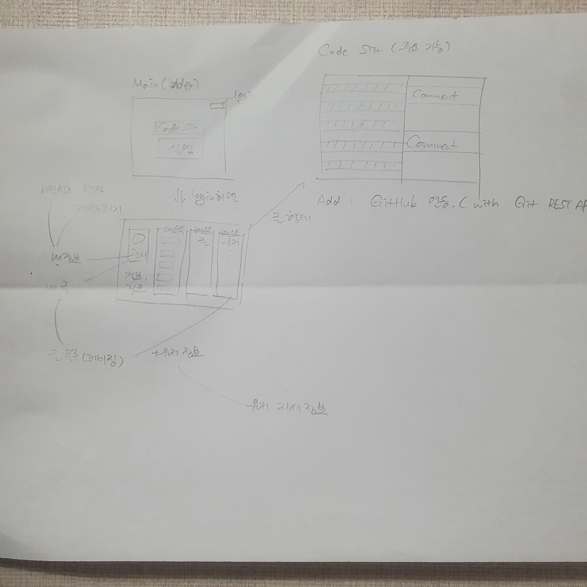
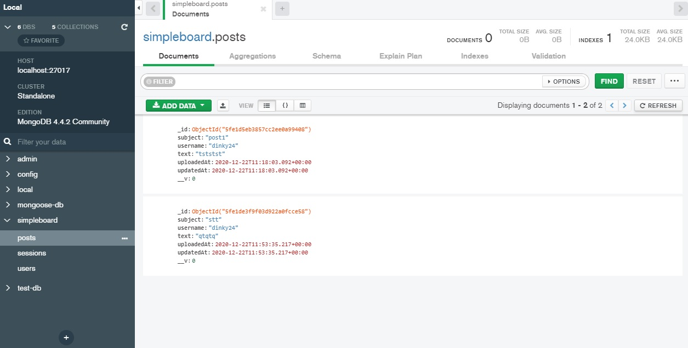
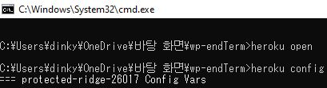
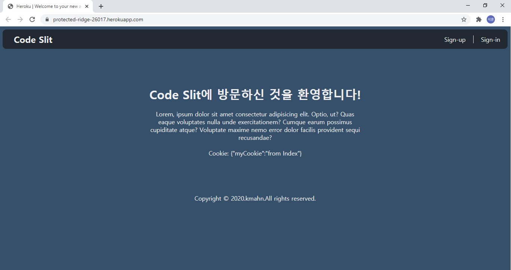

# WEB APPLICATION PROGRAMMING
## end-term project

> 프로젝트명: <b>CodeSlit</b> <br>
> 개발자: 배석훈 <br>
> Github 링크 : [LINK](https://github.com/S-Hun/wp-endTerm) <br>
> Web 링크 : [LINK](https://protected-ridge-26017.herokuapp.com/) <br>

현재 Web 링크 접속화면이 기본 화면으로 떠서 제 개인주소로 열었습니다. 제출한 링크 확인부탁드립니다.. 죄송합니다.

## 설계

<strong>1. 기능</strong>

코드를 보는 새로운 View의 구현을 목표로 양쪽으로 이중 뷰를 구현하고, 오른편에 코드 라인 추적이 되는 코맨트 뷰를 따로 만든다. 해당 뷰에서는 시각적인 하이라이터를 지원하며 Git API를 활용하여 코드 직접 등록이 아닌 읽어오기가 가능하도록 구현하는 것을 최종 목표로 한다.

<strong>2. 모양</strong>

Color : <b>[LINK](https://colorhunt.co/palette/2763)</b> 기반
* transition을 통한 시각적으로 움직이는 화면
* :active :hover 등의 action을 통한 색변화

HTML을 통하여 div 태그와 display 속성을 block과 inline으로 바꿔가며 배치하였고, float 속성을 활용하여 각각 블럭들을 배치하였습니다. 또 margin과 padding등 각각 블럭마다 조절하여 자연스러운 배치가 되도록 조정하고, % 사이즈와 float 속성을 활용하여 약간의 반응성을 두었습니다.

CSS를 활용하여 각 버튼에 active 형태가 나타나도록 구현하였으며, 색을 맞추었습니다. 추가적으로 각 블럭들의 border와 그 radius를 적절히 부드럽게 설정해주었으며, 클릭 및 반응에 따라 border 속성이 바뀌도록도 설정하였습니다. 이후 사용자 추가에 따른 level이나 user power 기능을 추가하여 랭크를 넣거나 Github처럼 유저 활동을 추적하는 페이지를 만든다면 transition을 적절히 활용할 수 있을 것 같습니다.

## 파일 TREE
```
│  .env
│  .gitignore
│  app.js
│  index.js
│  package-lock.json
│  package.json
│
├─env
│      index.js
│
├─middlewares
│      auth.js
│
├─mongo
│      index.js
│      post.model.js
│      user.model.js
│
├─node_modules
│ ├─ ...
│ ...
│ 
├─public
│  ├─css
│  │      auth.css
│  │      auth_index.css
│  │      index.css
│  │      main.css
│  │      post-form.css
│  │
│  └─js
│          join.js
│          login.js
│          poston.js
│
├─routes
│      auth.router.js
│      page.router.js
│      post.router.js
│
└─views
        error.html
        index.html
        join.html
        layout.html
        login.html
        post-form.html
```

## HTML

기본적으로 HTML은 layout을 extends하는 여러 개의 파일로 구성하였으며, include를 통한 포함하는 구조는 나타나지 않았습니다. 만약 좀 더 페이지를 확장한다면 HTML 페이지를 늘리고 include를 통해서 모듈화를 할 수 있을 것 같습니다. 기본적으로 extends 및 javascript를 통한 페이지 형성에 맞춰 페이지가 동작될 수 있도록 작성하였습니다.

## CSS

CSS를 통해 맞춘 기본색은 [LINK](https://colorhunt.co/palette/2763)에 맞추어 디자인하였으며, 좀 둥글둥글하고 고전적인 디자인을 원하여 디자인하였습니다. 그리고 좀 더 액티브한 웹 환경을 구성하기 위해서 마우스나 버튼에 따른 반응을 다양하게 나타낼 수 있도록 :hover :active 등의 기능을 백분 활용하였습니다. 마찬가지로 transition 기능을 여기저기에 추가해보았는데, 너무 무분별하게 추가하니 오히려 난잡해보여서 아주 작은 부분에만 사용하였습니다. 페이지가 확장되면 필요한 곳에만 선택적으로 활용하면 좋을 것 같습니다.

## JAVASCRIPT

댓글은 구현하지 못하고 게시글 부분만 구현하게 되었습니다. 먼저 post.router에서 post-form으로 Post.find({}) 정보를 넘겨주도록 하였으며, 이 결과를 로그인 하였을 때 글을 쓰게 되면 Post.create를 통해 DB에 생성한 글의 정보가 업로드 되고 이를 통해 DB의 posts collection에 데이터가 앃입니다. 이를 javascript를 활용하여 posts의 크기를 가져와 그 크기만큼 li 태그를 생성하게 하였으며, 각각 li 태그에 a 속성을 부여하여 각 페이지를 누르면 해당 글을 읽을 수 있는 페이지로 이동되어 해당 글의 작성자, 즉 현재 로그인 계정 user.username과 작성된 posts\[\].username이 같으면 지울 수 있는 버튼을 띄우도록 하여 해당 버튼을 통해 개인 계정을 관리할 수 있습니다.

댓글의 경우 schema를 추가하여 댓글 schema를 Post의 요소 중 하나로 추가하고 그 타입을 댓글로 지정하는 것으로 만들 수 있습니다. 마찬가지로 글을 읽는 페이지에서 나타나며 직접 댓글을 작성한 유저의 경우 해당 댓글을 지울 수 있도록 구현하고자 하였습니다. 

## NODEJS
기본적으로 수업에서 활용한 npm을 이용하여 nodejs를 활용하였습니다. express, morgan, cookie-parser, expression-session, nunjucks, mongoose 등을 설치하였고, res, req를 활용하여 페이지를 구현하였습니다. 기본적으로 "인증 처리" 파트의 부분을 분석하여 프로그램을 제작하였기에 express generator는 사용하지 않았지만, 마찬가지로 설치하였고 정말 편리하다는 것을 느꼈습니다. 템플릿을 활용하기 위한 nunjucks 그리고 서버 접속시 응답을 위한 morgan, 쿠키 증명을 위한 cookie-parser, 웹 유지를 위한 express 및 expression-session도 적절히 분석 및 활용하였습니다.

## DB

MongoDB를 사용했고, MongoDBCompass를 통한 관리를 하였습니다. mongoose 패키지를 npm i 명령어로 설치하고, mongoose connect를 통해 서버와 연결하였습니다. 이미 만들어진 auth.model외에 게시글(post) 추가를 위해서 post.model을 만들고 index에 추가하였으며 그 결과로 DB에 posts collection(schema string, string, string, date)이 추가되었습니다. auth 등록을 위한 User외에 Post라는 이름으로 model을 생성하였으며 post-form의 submit 결과를 poston.js 스크립트와 연결하여 새로운 글을 DB에 등록하도록 처리하였습니다.

다시 그 결과를 HTML에 포스팅하기 위해서 미들웨어를 활용하였으며, Post.find 미들웨어에서 결과 data를 posts로 전달하여 활용하였습니다. 

## AUTHORITY
인증처리는 Simple-board 예시를 거의 활용하였으며, 추가적으로 같은 index 페이지에서 인증이 되었느냐 아니냐에 따라 다른 화면이 보여지도록 하였습니다. 이는 로그인, 로그아웃을 통해 확인할 수 있으며, 로그인하지 않았을 때는 Code Slit 사이트의 소개 및 개요가 나오도록 하였고, Github 링크를 넣었습니다. 

로그인 하였을 때는 내 정보를 관리할 수 있는 블럭, 소식 블럭, 베스트 글 블럭, 베스트 유저 블럭으로 4가지를 볼 수 있으며, 로그인한 환경이기에 여기서 내 정보를 관리할 수 있도록 하였습니다. 그리고 로그인 되었기에 내 정보창에 계정 명을 띄워주었습니다. 

이 계정명은 글 쓸 때에도 확인하게 되며, middleware의 auth.js를 활용하여 로그인 되어 있지 않으면 로그인 화면으로 이동되도록 하였습니다. 주소 변환을 통한 악의적 접근을 방지하기 위하여 이렇게 설정하였습니다. 글을 등록하게 되면 DB에 계정명도 함께 저장되도록 user.username을 활용하여 저장하였습니다.
DB와 기능 및 서버 사이드 내용을 합하여 어떻게 인증 기능을 구현하였는지

## OTHER FUNCTIONS
1. Heroku 활용

Heroku 공식 사이트<sup>[LINK](https://devcenter.heroku.com/articles/getting-started-with-nodejs)</sup>와 여러 블로그를 참고하였습니다.




계속 접속하지 않으면 닫히는 것 같습니다. (DB 설정에 오류가 있었습니다.)

2. Github REST API

Github 사이트의 데이터를 활용하기 위한 API를 조사하였습니다만 사용하지 못하였습니다. 쓰는 방식이 이전에 활용했던 주소 API와는 좀 달랐습니다. 이 기능을 활용하여 직접 코드를 복붙하거나 치는 것 없이 Github 링크를 거는 것만으로도 글을 옮겨쓸 수 있고 Code Slit의 rigth view에 하이라이팅만 할 수 있도록 이용하려고 하였습니다.

## 아쉬운 점

Node.js 부분에서 많은 오류를 범하였습니다. 처음 사용해보기도 하였고, 제가 시도한 부분이 너무 늦기도 했고 호기심 있게 세세히 살펴보려다가 놓친 부분이 많았습니다. 그리고 많은 기능을 구현했고 또 구상했는데 실제로 모든 기능을 구현하지 못하여서 너무 아쉽고 무엇보다 핵심 기능인 코드 하이라이팅을 제대로 구현하지 못하여 너무 아쉽다는 마음이 듭니다. 그래도 이전에는 프론트 앤드라고 하기에도 부족한 HTML, CSS만 조금 아는 수준의 지식이었는데, Node.js를 사용하면서 프론트, 백 둘 다 좀 더 살펴보면서 겸손해질 수 있었던 것 같습니다. 이게 제가 발전할 수 있는 기회로 다가오면 좋겠습니다.